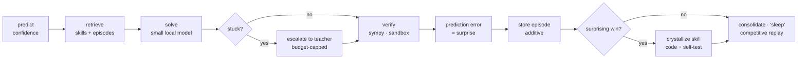
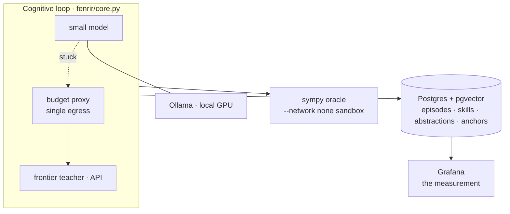

<a id="top"></a>
<div align="center">

# 🐺 Fenrir

### A cheap, compounding, self-improving loop for *verifiable* domains

*A small, locally-run model that gets better at a task over time — building memory and
crystallizing verified skills, leaning on an expensive "teacher" model less and less.*

<br/>

[](LICENSE)
[](pyproject.toml)
[](#status)
[](#purpose)

<br/>

**[Purpose](#purpose)** ·
**[Scientific base](#science)** ·
**[The loop](#loop)** ·
**[Architecture](#architecture)** ·
**[Constitution](#constitution)** ·
**[Measure](#measure)** ·
**[Run](#run)** ·
**[Support](#support)**

</div>

<br/>

<details>
<summary><b>📖 Table of contents</b></summary>

- [Purpose — the bet](#purpose)
- [Scientific base — the neuroscience](#science)
- [The loop — one task](#loop)
- [Architecture — the stack](#architecture)
- [Constitution — the rules it can't break](#constitution)
- [What we measure](#measure)
- [Run it](#run)
- [Status](#status)
- [Support the experiment](#support)
- [Docs & links](#links)
- [License & ethics](#license)

</details>

---

<a id="purpose"></a>
## 🎯 Purpose — the bet

Big models get smarter by getting **bigger**. Fenrir asks a different question:

> **Can a small, *owned* model reach frontier-level competence on the domains it works in —
> at 1–2 orders of magnitude less cost — by accumulating experience instead of scale?**

The idea: most of what a frontier model does on a narrow domain is **re-derive patterns it has
seen before**. Capture each solved problem as a reusable, *verified* skill, and the next similar
problem collapses to a cheap memory lookup. Run that over a stream of problems and competence
**compounds** — the skill library grows, and the model leans on the paid teacher *less and less*.

Fenrir is **not** "a brain," and **not** "a smarter LLM." It is a small, instrumented system that
turns **solved problems into a growing library of verified, executable skills** — and honestly
measures whether that produces **compounding** (real learning) or merely **recall**.

> 🔬 **The deliverable is the measurement, not the accuracy.** A flat learning curve is a
> **valid, recorded negative result** — not a bug to hide.

The reference domain is **mathematics**, because correctness there is *cheap to verify and hard to
game* (symbolic equivalence via `sympy`). That single property — an **ungameable verifier** — is
what decides where this approach may run autonomously at all → see [Constitution](#constitution).

<div align="right"><a href="#top">↑ back to top</a></div>

---

<a id="science"></a>
## 🧠 Scientific base — the neuroscience

The design is a faithful port of how the **hippocampus** consolidates memory: a **two-stage**
model — fast *bookmarking* while awake, then *competitive replay* during sleep. Not a metaphor —
each mechanism maps to a specific, cited result.

| Brain mechanism | In Fenrir | Source |
|---|---|---|
| **Sharp-wave-ripple bookmarking** — a significant event is tagged *once*, at encoding | one significance score per episode: `surprise × value × use` | SPW-R selective tagging · *Science* 2024 |
| **Prediction error gates plasticity** — surprise makes memory malleable; small error edits, large error spawns new memory | PE is the master signal; reflection & skill-formation fire on *surprise*, not uniformly | *PNAS* 2021; L&M 2018 |
| **Forgetting drives abstraction** — what isn't reactivated fades, leaving the gist | read-time exponential decay of significance; anchors never fade; reversible by re-access | *Frontiers in Psychology* 2014 |
| **Replay collapses many traces into one map** — sleep replays the salient, generalizing | "sleep" clusters similar episodes, replays them in proportion to significance, merges each cluster into **one** strengthening abstraction | Go-CLS · *Nature Neuroscience* 2023; Spens & Burgess · *Nat. Hum. Behav.* 2024 |
| **Pattern separation** — keep similar-but-distinct memories apart (anti-blur) | a coherence guard splits over-broad clusters instead of collapsing distinct methods | PMC7365015 (2020); Epp et al. · *Nat. Comms* 2016 |
| **Regulated, not greedy** — consolidation is selective and gated | a per-cluster **predictability gate**: an abstraction is kept only if it doesn't regress on held-out problems | Go-CLS · *Nature Neuroscience* 2023 |

<sub>The two-stage framing (fast familiarity → slow controlled recollection) follows Norman &
O'Reilly. The skill half — verified, executable, composable skills formed on impasse — draws on
**Voyager** and the **SOAR / ACT-R** tradition of impasse-driven chunking.</sub>

<div align="right"><a href="#top">↑ back to top</a></div>

---

<a id="loop"></a>
## 🔁 The loop — one task

Every task runs through one cycle. Effort concentrates where the system was **surprised**.



| Step | What happens |
|---|---|
| **1 · Predict** | record the expected outcome + confidence *before* solving (so surprise is measurable) |
| **2 · Retrieve** | pull prior skills + episodes (vector + lexical) |
| **3 · Solve** | the small, owned model attempts it |
| **4 · Escalate** | call the frontier *teacher* **only when stuck**, under a hard daily budget cap |
| **5 · Verify** | `sympy` symbolic equivalence in a `--network none` sandbox — never text-match or an LLM judge |
| **6 · Surprise** | compute prediction error — the signal that gates everything downstream |
| **7 · Remember** | write an **additive** episode (memory is never hard-deleted) |
| **8 · Crystallize** | turn a *surprising* win into executable, self-tested code |
| **9 · Consolidate** | "sleep": competitive replay merges similar episodes into stronger abstractions |

<div align="right"><a href="#top">↑ back to top</a></div>

---

<a id="architecture"></a>
## 🏗️ Architecture — the stack

A single-node stack. Everything durable lives in Postgres; compute is a swappable pool.



| Component | Role |
|---|---|
| 🧩 **Small model** (Ollama, local GPU) | the owned solver — does most of the work, for free |
| 🎓 **Frontier teacher** (API) | called **only when stuck**, behind the budget proxy + hard daily cap |
| 🚪 **Budget proxy** (`fenrir/llm/`) | the *single egress* for every model call — meters spend, enforces the cap |
| 🗄️ **Postgres + pgvector** | the durable asset: episodes, skills, abstractions, invariant anchors — all vector-searchable |
| ✅ **`sympy` oracle + sandbox** | ungameable verification; untrusted code runs network-isolated |
| 📊 **Grafana** (`dashboard/`) | the instrument — falsifiable curves + a human "are we learning?" view |

> ℹ️ **Compute is a dynamic pool.** One always-on node holds *all state* + the small-model loop;
> bigger machines accelerate solving and deep consolidation when present; the paid API is the floor.
> A worker vanishing mid-task costs throughput, never state — a stale-lock reclaim retries it.
>
> *Infrastructure, hosts, deployment and secrets are intentionally omitted from this public mirror.
> What ships is the reproducible, secret-free stack: schema, compose, and `.env.example`.*

<div align="right"><a href="#top">↑ back to top</a></div>

---

<a id="constitution"></a>
## ⚖️ Constitution — the rules it can't break

Thirteen non-negotiable principles govern every change. The whole approach rests on them.

| # | Principle |
|---|---|
| **I** | **Math-only pilot** — expansion follows the *verifiability ladder*, never ad-hoc |
| **II** | **External, ungameable verification is mandatory** — `sympy`, never a text match or LLM judge |
| **III** | **The evaluation pool is never trained on** — held-out stays held-out, always |
| **IV** | **Prediction error gates learning** — no crystallizing what the model already knew |
| **V** | **Consolidation is regulated** — merges must pass a predictability gate (no over-generalizing) |
| **VI** | **Episodes are additive** — never hard-deleted; consolidation marks, never destroys |
| **VII** | **Skills are versioned** before any modification |
| **VIII** | **Learner / judge / curriculum are separated** — no grading your own homework |
| **IX** | **The daily budget is a hard cap** — the teacher cannot blow the bank |
| **X** | **Sandboxes have no network** except the internal model proxy |
| **XI** | **Scope discipline** — unproven heavy components are deferred (complexity is the enemy) |
| **XII** | **Human-in-the-loop** at critical self-modifying steps (e.g. schema migrations) |
| **XIII** | **Autonomous only where verification is cheap & ungameable** — else decision-support only |

<div align="right"><a href="#top">↑ back to top</a></div>

---

<a id="measure"></a>
## 📈 What we measure

"Accuracy went up" does **not** prove learning — the base model may already solve it, or it leaked
from pretraining. Fenrir is built to isolate the *memory system's* contribution and to falsify
itself:

- ⭐ **Reuse rate** — are consolidated abstractions actually applied to later tasks? *(the headline)*
- 📉 **Teacher-escalation rate** — does the small model need the paid teacher *less* over time?
- 💸 **Cost per solved task** — does the Nth similar problem get *cheaper*?
- 📚 **Skills accumulated** — the durable asset, growing.

**Compounding is demonstrated only if reuse rises while escalation and cost fall — together.** A
flat reuse curve is reported honestly. Two Grafana dashboards render this: an engineer **Learning**
view and a human **"Are we learning?"** verdict view.

<div align="right"><a href="#top">↑ back to top</a></div>

---

<a id="run"></a>
## ⚡ Run it

```bash
pip install -e .[dev]

# stack: Postgres + pgvector, Redis, Grafana  (see infra/docker-compose.yml)
cp infra/.env.example infra/.env        # fill in the blanks
docker compose -f infra/docker-compose.yml up -d

python -m fenrir.db migrate             # ordered, idempotent migrations
python -m fenrir.core --once            # one task, end-to-end
python -m fenrir.core --run 50          # a cohort (consolidates on cadence)

pytest tests/                           # the Success-Criteria suite
```

You provide: a local model server (Ollama), a frontier-teacher API key, and a daily budget cap.

<a id="status"></a>
### Status

Math pilot, single node, **running**. Solves real GSM8K + MATH problems, verifies them
symbolically, crystallizes teacher-taught wins into self-tested skills, and consolidates by
competitive replay. The open question under measurement: does **reuse** rise while **escalation**
and **cost** fall?

<div align="right"><a href="#top">↑ back to top</a></div>

---

<a id="support"></a>
## ❤️ Support the experiment

Fenrir runs on one self-hosted node plus a paid frontier teacher under a hard daily cap.
Donations go **straight to compute**:

- 🔌 **Frontier API credits** — more teacher calls = faster learning while the library is thin.
- 🖥️ **Local-inference hardware** — e.g. a **Mac Mini** lets the small-model loop run more often,
  cheaper, and lean on the paid teacher *less* — which is literally the thing being measured.

→ **[☕ ko-fi.com/javierspn](https://ko-fi.com/javierspn)** — or the repo's **Sponsor** button (top of page).
Every euro is logged against the "Mac Mini fund" goal and spent only on compute.

<div align="right"><a href="#top">↑ back to top</a></div>

---

<a id="links"></a>
## 🔗 Docs & links

| | |
|---|---|
| ⚖️ **[Ethics & intended use](ETHICS.md)** | the autonomy boundary — read before deploying |
| 📜 **[License (Apache-2.0)](LICENSE)** | |
| 🗂️ **[`specs/`](specs/)** | the spec-driven design record — spec → plan → research → contracts → tasks |
| 🧱 **[`fenrir/`](fenrir/)** | the loop, memory, consolidation, skills, verifier, sandbox, proxy |
| 📊 **[`dashboard/`](dashboard/)** | Grafana panels — the measurement |
| 🐳 **[`infra/`](infra/)** | schema migrations + docker-compose (secret-free) |

<a id="license"></a>
### License & ethics

[**Apache-2.0**](LICENSE). Please also read **[ETHICS.md](ETHICS.md)**: Fenrir's autonomous loop is
intended **only for domains with a cheap, ungameable verifier** (math, code, digital logic).
Unverifiable / high-stakes domains — medicine, law, finance, strategy — are **decision-support
only**: a human owns the verifier and the decision.

<br/>

<div align="center">
<sub>🐺 Public mirror of a private research repo · exported on a cadence with a fail-closed secret gate · infrastructure intentionally omitted</sub>
<br/><br/>
<a href="#top">↑ back to top</a>
</div>
